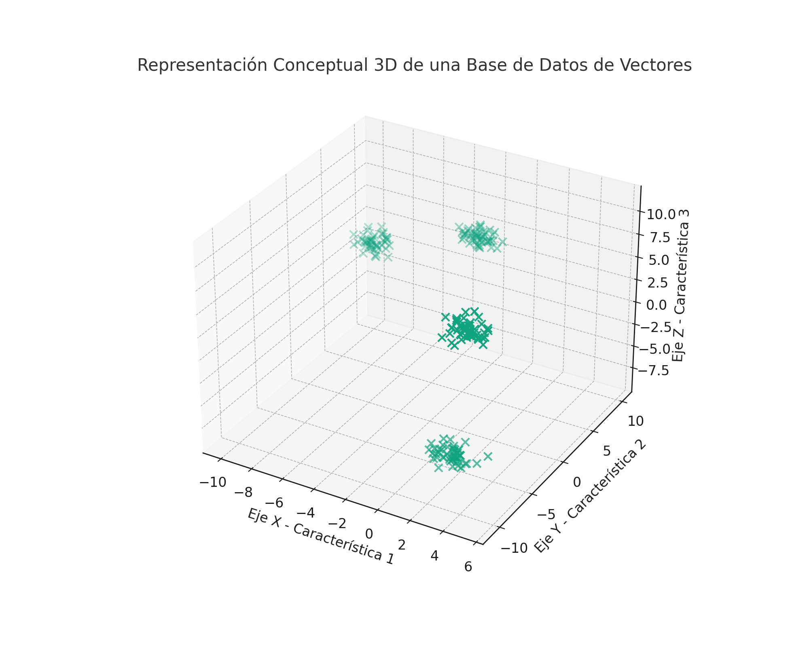

# Base de Datos de Vectores para Modelos de Lenguaje de Gran Escala (LLM)

Bienvenidos al módulo sobre **Bases de Datos de Vectores para LLM**. Este tema es esencial para entender cómo los Modelos de Lenguaje de Gran Escala (como GPT-3 y sus sucesores) gestionan y recuperan información de manera eficiente.

## ¿Qué es una Base de Datos de Vectores?

Una **Base de Datos de Vectores** es un sistema especializado en el almacenamiento, búsqueda y manejo de vectores, que son arrays de números que representan diversos tipos de datos en un espacio multidimensional. En el contexto de los LLM, estos vectores suelen representar palabras, frases, párrafos o incluso documentos enteros codificados en un espacio de características.

## Importancia en los LLM

Los LLM como GPT transforman el texto en vectores a través de un proceso llamado _embedding_, donde cada vector captura la esencia semántica de un fragmento de texto. Estos vectores se utilizan para realizar operaciones como la búsqueda semántica o la clasificación de texto.

## Operaciones Principales

En una Base de Datos de Vectores, las operaciones más comunes son:

- **Inserción**: Agregar nuevos vectores al sistema.
- **Búsqueda**: Encontrar los vectores más similares a un vector de consulta.
- **Actualización**: Modificar vectores existentes.
- **Eliminación**: Remover vectores del sistema.

## Casos de Uso en LLM

- **Búsqueda Semántica**: Permite encontrar respuestas relevantes a preguntas basadas en la similitud semántica más que en coincidencias exactas de palabras.
- **Agrupación**: Organizar grandes cantidades de texto en grupos basados en su similitud.
- **Recomendación de Contenido**: Sugerir artículos o documentos relevantes a partir de la similitud con intereses previos.

## Desafíos Técnicos

- **Escalabilidad**: Manejar la creciente cantidad de datos generados por los LLM.
- **Velocidad**: Retornar resultados en tiempo real.
- **Precisión**: Mantener una alta calidad en los resultados de la búsqueda.

## Herramientas y Tecnologías

Algunas herramientas y tecnologías populares para implementar bases de datos de vectores incluyen:

- [Elasticsearch](https://www.elastic.co/)
- [Faiss de Facebook AI](https://github.com/facebookresearch/faiss)
- [Milvus](https://milvus.io/)
- [Weaviate](https://www.semi.technology/developers/weaviate/current/)

## Conclusión

Las Bases de Datos de Vectores son una pieza clave en la infraestructura necesaria para desplegar LLMs eficientes y escalables. Permiten manipular la información a una escala y con una precisión que las bases de datos tradicionales no pueden ofrecer.

---

Este post es parte del curso de Ingeniería del Conocimiento, donde exploramos cómo las tecnologías emergentes están cambiando la forma en que gestionamos y obtenemos conocimiento de grandes volúmenes de datos.

